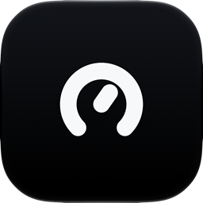
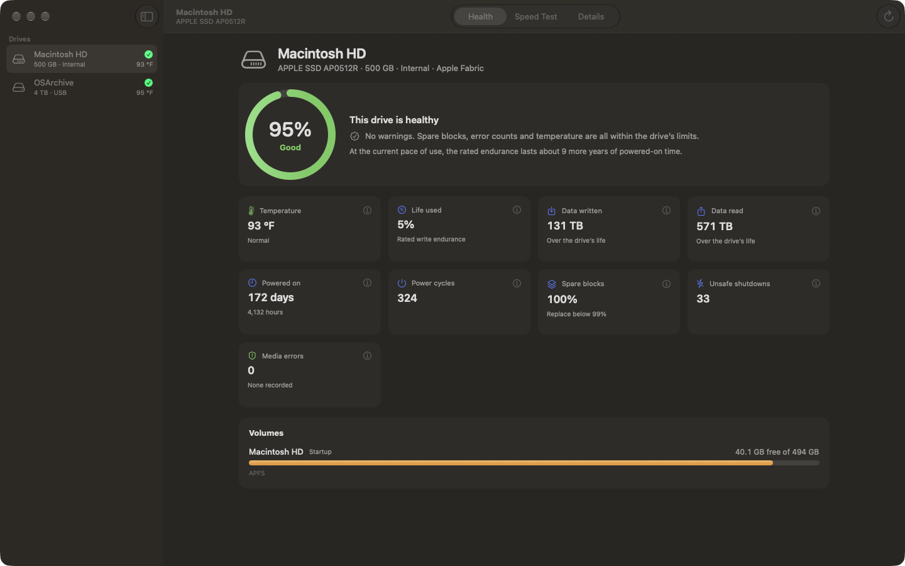
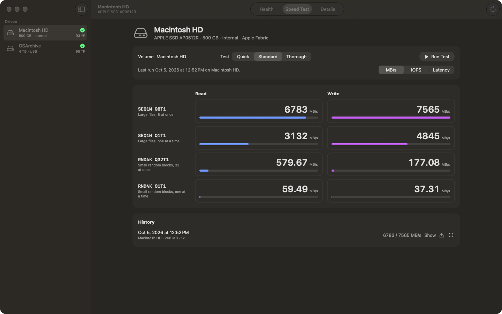
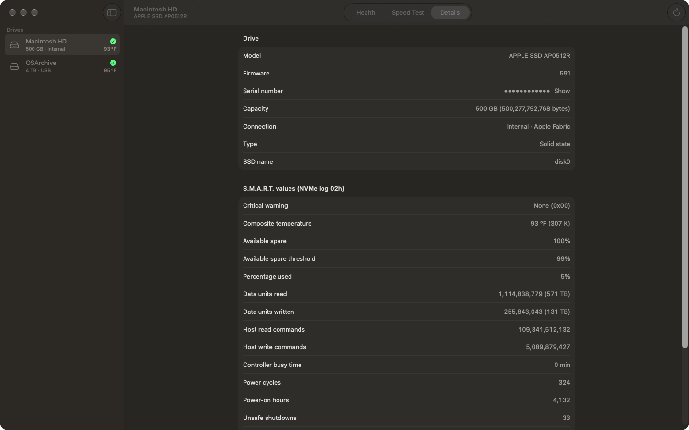

<p align="center"></p>

<h1 align="center">oDisk</h1>

<p align="center">Drive health and speed tests for macOS</p>

<p align="center">
  <a href="https://orgista.com/odisk"></a>
  <a href="https://github.com/orgista/odisk/releases/latest"></a>
  
  
  <a href="LICENSE"></a>
</p>

<p align="center"></p>

oDisk shows how healthy your Mac's drives are and how fast they run. It reads the S.M.A.R.T. data that NVMe drives report to macOS, from the internal SSD and from external NVMe drives on USB and Thunderbolt, and turns it into a verdict with the reasons written out. The speed test runs the four standard measurements (sequential 1 MiB and random 4 KiB, at queue depth 1 and with many requests in flight) and keeps a history.

It's a native SwiftUI app. There are no accounts, ads or analytics, and it makes no network connections.

## Installation

### Mac App Store

[Get oDisk on the Mac App Store](https://orgista.com/odisk) for $4.99. The store version is signed, sandboxed and updates automatically, and buying it pays for development.

### Build from source

You need macOS 15 or later and Xcode 26 or later.

```bash
git clone https://github.com/orgista/odisk.git
cd odisk/App
xcodegen generate   # brew install xcodegen
open oDiskApps.xcodeproj
```

Choose the `oDisk` scheme, set your own team under Signing & Capabilities, and run. The core library and its tests also build without Xcode:

```bash
swift test
swift run odisk-cli drives
```

## Features

| Health | Speed test |
|---|---|
| Verdict per drive (Good, Caution, Back up now) with reasons | SEQ1M Q8T1, SEQ1M Q1T1, RND4K Q32T1, RND4K Q1T1, read and write |
| Remaining life and rated endurance used | Bypasses the file cache (`F_NOCACHE`), random incompressible data |
| Temperature with a live chart and the drive's own limits | Quick, Standard and Thorough profiles |
| Data written and read, power-on time, power cycles | MB/s, IOPS or average latency |
| Unsafe shutdowns, spare blocks, media errors | History per drive, share results as text |
| Every raw NVMe value with an explanation | Runs on any volume you pick |

Other details: a menu bar summary of every drive, a copyable health report, Celsius or Fahrenheit, keyboard shortcuts (⌘1 Health, ⌘2 Speed Test, ⌘3 Details, ⌘R run).

<p align="center">
  
  
</p>

## Supported drives

| Drive | Health | Speed test |
|---|---|---|
| Internal SSD on Apple silicon and T2 Macs | Yes | Yes |
| External NVMe SSD over USB or Thunderbolt (for example Samsung T7, T9, many USB4 enclosures) | Yes, when the enclosure passes it through | Yes |
| SATA SSDs and hard disks in USB enclosures | Usually no (macOS doesn't expose ATA S.M.A.R.T. through most bridges) | Yes |
| SD cards, disk images, network shares | No | SD cards yes |

## FAQ

**How is health calculated?**
From the NVMe health log (page 02h): the drive's own critical warning flags, available spare against its threshold, percentage used, media errors and temperature against the limits in its Identify data. The thresholds follow CrystalDiskInfo's NVMe behaviour. The policy is a pure function in [`HealthPolicy.swift`](Sources/ODiskCore/HealthPolicy.swift) with unit tests.

**How does the app read S.M.A.R.T. inside the App Sandbox?**
Through Apple's NVMeSMARTLib plug-in, with a sandbox exception for the two read-only SMART user clients (`AppleNVMeSMARTUserClient`, `AppleNVMeTranslationSMARTUserClient`). See [`smart.c`](Sources/CODiskSMART/smart.c) and [`oDisk.entitlements`](App/oDisk/oDisk.entitlements).

**Why do my numbers differ from another benchmark?**
File size, queue depth, how full the drive is, its temperature and background activity all change results. Queue depth is emulated with one thread and file descriptor per outstanding request, since macOS has no user-space submission queue. Compare runs made with the same app and settings.

**Does oDisk change anything on my drive?**
No. It only reads the health log and writes a temporary test file, which it deletes when the test ends or is cancelled.

## Project layout

```
Sources/CODiskSMART   C shim for the NVMe SMART COM plug-in
Sources/ODiskCore     drive discovery, NVMe parsing, health policy, benchmark engine
Sources/ODiskUI       SwiftUI views and app state
Sources/odisk-cli     developer CLI (drives, bench)
Tests/                Swift Testing suites
App/                  thin macOS app target (xcodegen project.yml), entitlements, icon
scripts/e2e.sh        end-to-end run of the sandboxed app with screenshots
```

## Contributing

Issues and pull requests are welcome. Please run `swift test` and `scripts/e2e.sh` before opening a pull request, and attach a health report (Details › Copy Health Report) when a drive is shown wrongly.

## Acknowledgements

[CrystalDiskInfo](https://github.com/hiyohiyo/CrystalDiskInfo) (MIT) for its NVMe health thresholds and [Stats](https://github.com/exelban/stats) (MIT) for showing how to reach NVMe SMART on macOS. oDisk contains no GPL code.

## License

[Apache License 2.0](LICENSE). © 2026 Orgista.
